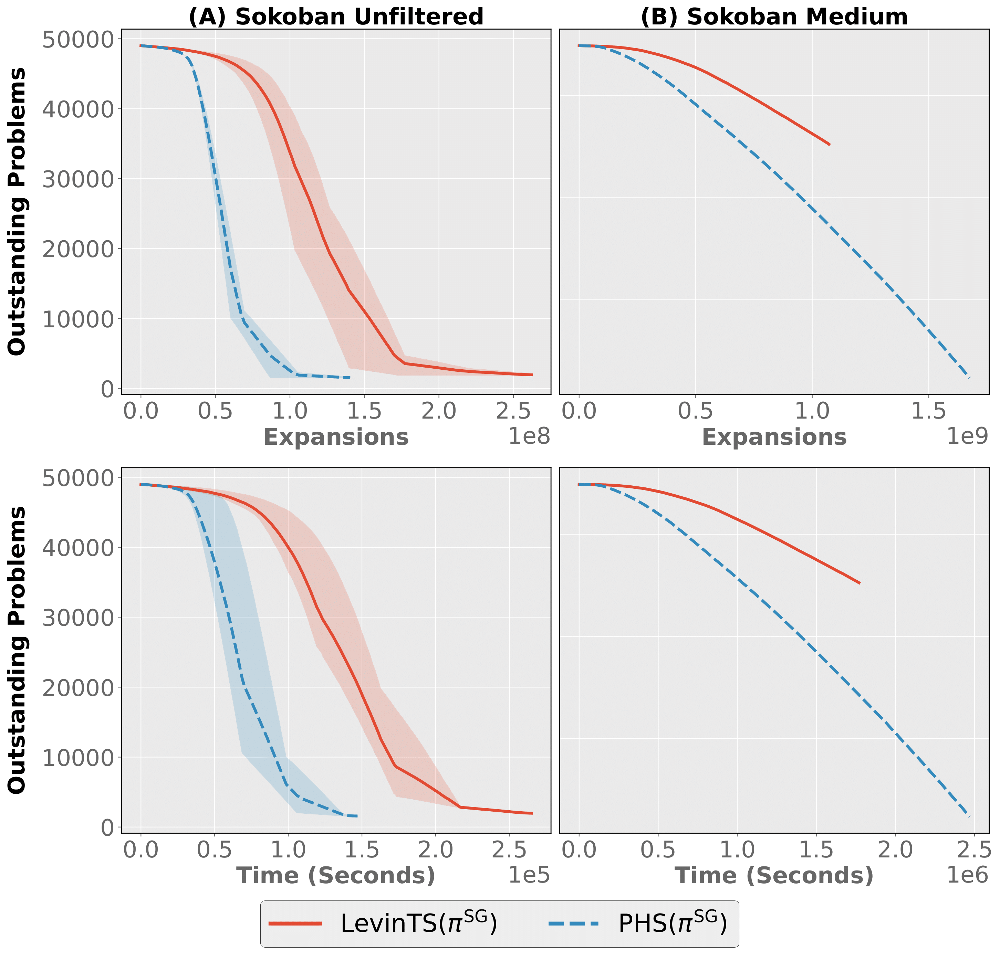

# Subgoal-Guided Policy Heuristic Search with Learned Subgoals
This repo contains training and test results for $\text{LevinTS}(\pi^{\text{SG}})$ and $\text{PHS}^*(\pi^{\text{SG}})$ from [Subgoal-Guided Policy Heuristic Search with Learned Subgoals](https://icml.cc/virtual/2025/poster/45623). 
Jake Tuero and Michael Buro and Levi Lelis (2025). 
Subgoal-Guided Policy Heuristic Search with Learned Subgoals.
*Forty-second International Conference on Machine Learning*.

Problems used are from the [Boxoban](https://github.com/google-deepmind/boxoban-levels) dataset. 

## Training and Testing Procedure

### Sokoban Unfiltered
- The first 50,000 unfiltered problems were used during training, first 1,000 problems used in testing. 
- For each seed, a random split of 49,000 training problems and 1,000 validation problems chosen. 
- An initial budget of 4,000 node expansions with inference batch size of 32. 

### Sokoban Medium
- The first 450,000 medium problems used during training, and all hard problems used in testing.
- For each seed, a random split of 449,000 training problems and 1,000 validation problems chosen.
- An initial budget of 20,000 node visits with inference batch size of 32.
- For testing, a max budget of 1,024,000 was used.

## Results
The plot `png`/`pdf`, and summary data tables in `csv` format are in the `./data` and `./assets` folders.

### Hardware 
The algorithms and environment are implemented in C++, adhering to the C++20 standard.
The codebase is compiled using the *GNU Compiler Collection* version 15.2.0, and uses the PyTorch 2.4 C++ frontend.
All experiments were conducted on an Intel i9-7960X and Nvidia 3090, with 128GB of system memory running Ubuntu 24.04, and uses (8) threads for each experiment run.

### Training Curves
The time listed for the training plot curves is the sum of time each algorithm uses on each problem, summed over all the threads (8) used during training.

### Training - Unfiltered
Below is the table of results summarizing the training plot above, using the average over all seeds.
The `Thread Sum Time` column corresponds to the time in the plot, which measures the sum of time each algorithm uses on each problem, summed over all the threads (8) used during training.
The `Wall Time` column displays the wall clock the entire experiments took as a reference point.
Time is measured in hours here.

|Algorithm                 |Solved |Expanded   |Thread Sum Time|Wall Time (Hours)|
|--------------------------|-------|-----------|---------------|---------|
|LevinTS$(\pi^{\text{SG}})$|47,226.2|233,050,490.8|69.7891        |13.6405  |
|PHS$(\pi^{\text{SG}})$    |47,452.0|127,096,718.6|38.1456        |7.982    |

### Training - Medium
Below is the table of results summarizing the training plot above.
The `Thread Sum Time` column corresponds to the time in the plot, which measures the sum of time each algorithm uses on each problem, summed over all the threads (8) used during training.
The `Wall Time` column displays the wall clock the entire experiments took as a reference point.
Time is measured in hours here.

|Algorithm                 |Solved |Expanded   |Thread Sum Time|Wall Time (Hours)|
|--------------------------|-------|-----------|---------------|---------|
|LevinTS$(\pi^{\text{SG}})$|196,890.0|1716,636,084.0|788.2938       |119.4542 |
|PHS$(\pi^{\text{SG}})$    |325,624.0|1675,445,853.0|685.6491       |109.4961 |

### Test - Unfiltered
The `Time` value here measures the sum of time each algorithm uses on each problem, summed over all the threads (8) used during testing.
|Algorithm          |Num Solved|Expansions|Expansions|Solution Cost|Solution Cost|Time (s)|Time (s)|
|-------------------|----------|----------|----------|-------------|-------------|--------|--------|
|                   |          |mean      |sem       |mean         |sem          |mean    |sem     |
|LevinTS$(\pi^{SG})$|1,000.0   |2,204.16  |317.25    |35.87        |0.25         |2.54    |0.18    |
|PHS$(\pi^{SG})$    |1,000.0   |1,448.10  |180.92    |34.85        |0.26         |1.88    |0.16    |

### Test - Hard
The `Time` value here measures the sum of time each algorithm uses on each problem, summed over all the threads (8) used during testing.
|Algorithm          |Num Solved|Expansions|Expansions|Solution Cost|Solution Cost|Time (s)|Time (s)|
|-------------------|----------|----------|----------|-------------|-------------|--------|--------|
|                   |          |mean      |sem       |mean         |sem          |mean    |sem     |
|PHS$(\pi^{SG})$    |3,308.0   |41,065.93 |1,724.99  |67.45        |0.43         |56.02   |2.29    |
